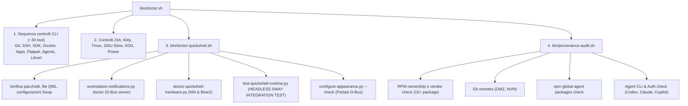

# Fedora Workstation Setup Scope Report

> Data di generazione: 2026-09-16  
> Baseline analizzata: commit `7314cc78` (`feat/quickshell-desktop-tools`)  
> Sistema target: Fedora Linux 44 (x86_64), Sway con systemd, Quickshell  

---

## 1. Executive Summary

Il repository `fedora-workstation-setup` nasce storicamente come un orchestratore completo per allestire da zero una macchina Fedora. Dall'analisi approfondita del codice (`install.sh`, tutti i 22 moduli in `modules/`, gli helper in `bin/` e l'infrastruttura di test), emergono i seguenti riscontri chiave:

1. **Il setup attuale NON è esclusivamente desktop-focused:**  
   Il setup mescola nello stesso flusso di installazione tre domini completamente eterogenei:
   - **Ambiente Desktop / Graphical Workstation:** Compositor Sway, shell desktop Quickshell, display manager Greetd, terminale Kitty, audio PipeWire, Bluetooth BlueZ, portali XDG, tema Adwaita, wallpaper e dotfiles gestiti via GNU Stow.
   - **Toolchain di Sviluppo Software e SDK:** Compilatori C/C++, CMake, TeX Live (~1.5 GB), Java via SDKMAN, Node.js via NVM, Python via Miniconda, VS Code, DBeaver, Bruno, JetBrains Toolbox.
   - **Infrastruttura, Homelab e Container:** Daemon Tailscale, client VPN (OpenVPN, OpenConnect), container engine Docker rootless, hypervisor KVM/QEMU, libvirt e Vagrant.
   - **Agenti AI:** Binari proprietari standalone di OpenAI Codex, Anthropic Claude Code e GitHub Copilot CLI.
   - **Applicazioni Personali / Extra:** Discord (Flatpak), Obsidian (Flatpak), Thunderbird, LibreOffice, Cliamp player audio terminale.

2. **La modalità `--all` soffre di grave scope creep:**  
   L'opzione `--all` non si limita a installare il desktop completo, ma esegue tutti i moduli di sviluppo, agenti AI, virtualization e container daemons, trasformando una richiesta di workstation grafica in una complessa installazione multi-gigabyte con decine di repository e servizi persistenti.

3. **Situazione critica di `doctor.sh`:**  
   `doctor.sh` impiega attualmente **~21.9 secondi** per completare l'esecuzione e termina con **codice di uscita 1 (FAIL)** anche su un sistema desktop perfettamente funzionante.  
   Le cause principali sono due:
   - **Inclusione impropria di test di integrazione:** Richiama `bin/doctor-quickshell.sh`, che a sua volta esegue `bin/test-quickshell-runtime.py`. Questo script avvia un compositor Sway headless virtuale con due output fittizi per testare 44 selettori QML e popups, impiegando da solo **18.1 secondi** (l'82.4% dell'intero tempo). Tale test appartiene alla test suite (`bin/test.sh`), non a una diagnostica rapida dello stato di salute del sistema.
   - **Controlli su componenti opzionali trattati come errori bloccanti:** `bin/provenance-audit.sh` controlla la presenza degli agenti Claude e Copilot. Se non sono installati, fallisce con errore (`FAIL claude: agente assente`), provocando il fallimento dell'intero `doctor.sh` anche quando l'utente desidera soltanto usare il desktop.
   - **Verifiche di runtime pesanti fuori scope:** `doctor.sh` interroga il daemon Docker (`docker info`), la socket di libvirt (`virsh -c qemu:///system`), l'albero globale dei moduli npm (`npm list --global`), scannerizza i package Flatpak e avvia persino un server tmux effimero via socket UNIX per verificarne le opzioni.

---

## 2. Install Entry Points

L'entry point principale è `install.sh`. La tabella seguente riassume i profili e i flag disponibili, i moduli invocati, cosa installano e configurano, e la loro categoria di appartenenza:

| Flag / Profilo | Moduli invocati | Cosa installa | Cosa configura | Categoria | Incluso in `--all`? | Effetti collaterali / Note |
|---|---|---|---|---|---|---|
| `--base` | `00-directories`, `10-system-packages` (base), `12-tailscale`, `15-xdg-user-dirs`, `20-shell`, `25-zsh-theme`, `80-git`, `90-power-mode`, `05-agent-context` | Git, Gitk, OpenSSH, tool archivio/compressione, Stow, Zsh, Tailscale, Starship, TuneD | Cartelle XDG standard in inglese, directory `~/Tools` e `~/Progetti`, Oh My Zsh, Starship prompt, configurazione globale Git, `laptop-power-mode.service`, `tailscaled.service`, context agenti `~/.agent` | Misto (Core Desktop, Support, Homelab) | Sì | Abilita servizi di sistema persistenti (`tailscaled`, `tuned`, `laptop-power-mode`), installa `cifs-utils` e Tailscale senza che appartengano allo scope desktop. |
| `--dev` | `00-directories`, `10-system-packages` (dev), `26-kitty`, `27-tmux`, `30-sdkman`, `40-node`, `50-miniconda`, `55-docker`, `57-virtualization`, `60-vscode`, `05-agent-context` | Toolchain C/C++, CMake, TeX Live medium, OpenVPN, OpenConnect, Kitty, tmux, SDKMAN (Java Temurin, Maven, Gradle), NVM (Node LTS, Corepack), Miniconda3, Docker CE rootless, QEMU/KVM, libvirt, virt-manager, Vagrant, VS Code | Terminale Kitty, configurazione tmux, shell integration per Java/Node/Conda in `env.zsh`, Docker rootless per l'utente, gruppi `kvm` e `libvirt`, rete virtuale libvirt default, repo Microsoft VS Code | C (Development) + F (Homelab/Infra) | Sì | Download molto pesanti (~3-5 GB), creazione socket e user unit systemd (`docker.service`), installazione TeX Live (~1.5 GB), aggiunta utente ai gruppi `kvm`/`libvirt`. |
| `--all` | Esegue tutti i moduli di `--base` + `--dev` + `45-agents` + `70-desktop-apps` + `05-agent-context` | Tutto quanto elencato in `--base` e `--dev`, più OpenAI Codex, Claude Code, Copilot CLI, DBeaver CE, Bruno, JetBrains Toolbox, Thunderbird, LibreOffice, Discord Flatpak, Obsidian Flatpak | Tutte le configurazioni dei moduli precedenti, flatpak repo flathub utente, link e wrapper in `~/.local/bin` | Misto (Dev, AI, Personal, Homelab) | N/A (è il flag `--all`) | **NON imposta `DESKTOP_ENV`**: l'ambiente desktop (`--sway` o `--gnome`) deve comunque essere passato esplicitamente. |
| `--sway` | `75-sway-desktop` (invoca anche `26-kitty`) | Sway, waybar, fuzzel, foot, mako, swayidle, swaylock, stow, grim, slurp, wl-clipboard, brightnessctl, playerctl, pavucontrol, nm-applet, portali XDG, lxqt-policykit, wireplumber, font Cascadia Mono NF, greetd, gtkgreet | Applica dotfiles Stow (`sway`, `swaylock`, `waybar`, `scripts`, `desktop-theme`), sfondi in `~/.local/share/backgrounds`, regole finestre floating Sway, tema Adwaita GTK, configurazione greeter `/etc/greetd` (disabilita SDDM, abilita Greetd), gestione lid logind | A (Core Desktop) + B (Desktop Support) | No (va specificato esplicitamente) | Sovrascrive display-manager di sistema con greetd; applica Kitty come dipendenza terminale. |
| `--config-quickshell` | `76-quickshell` | Quickshell (RPM ufficiale Fedora), python3-gobject, NetworkManager-libnm, libnotify, dipendenze Wayland (se mancanti), BlueTUI (binario statico upstream) | Drop-in Sway `90-bar.conf`, servizio utente `workstation-bar.service`, dotfiles Stow (`quickshell`, `systemd-user`, `scripts`), maschera Mako su D-Bus/systemd, configura floating rules per BlueTUI e helper | A (Core Desktop) + B (Desktop Support) | No (opzione esplicita per Sway) | Modifica la barra e il notification center predefiniti di Sway, disattivando Mako e Waybar in favore di Quickshell. |
| `--gnome` | `76-gnome-desktop` | gnome-shell, gnome-control-center, gnome-terminal, gnome-shell-extension-dash-to-dock | Abilita estensione Dash-to-Dock via `gnome-extensions`, imposta pulsanti finestra minimizza/massimizza in gsettings | A (Core Desktop) alternativo | No (mutuamente esclusivo con `--sway`) | Non compatibile con Quickshell. |
| `--agent` | `45-agents` | Codex standalone, Claude Code nativo, Copilot CLI | Directory in `~/Tools/Agents`, permessi 700, link in `~/.local/bin`, disinstallazione versioni legacy npm | E (AI / Agents) | Sì (tramite `--all`) | Scarica binari ed esegue script di installazione vendor esterni. |
| `--extra` | `65-extra` | alsa-lib, ffmpeg-free, yt-dlp, Cliamp binary | Link `~/.local/bin/cliamp`, dotfiles Stow `extra`, desktop file per Cliamp | D (Personal Software) | No (solo su richiesta esplicita) | Modifica la configurazione Sway per regole scratchpad/floating di Cliamp. |
| `--set-wallpaper` | `bin/set-wallpaper.sh` | Nessun pacchetto | Cambia symlink wallpaper e notifica Sway/Swaylock | B (Desktop Support) | No | Script interattivo / selettore rapido. |

---

## 3. Installed Software & Component Inventory

Classificazione di ogni singolo software gestito secondo le categorie richieste:
- **A — CORE DESKTOP:** Necessario direttamente al funzionamento dell'ambiente grafico.
- **B — DESKTOP SUPPORT:** Servizi e strumenti a supporto dell'esperienza desktop configurata.
- **C — DEVELOPMENT ENVIRONMENT:** Tool per lo sviluppo software indipendenti dal desktop.
- **D — PERSONAL SOFTWARE:** Applicazioni personali, produttività e media.
- **E — AI / AGENTS:** Tooling LLM e assistenti di programmazione.
- **F — HOMELAB / INFRA:** Virtualizzazione, container e reti remote.
- **G — QUESTIONABLE / UNUSED:** Software installato privo di utilizzo effettivo nel setup corrente.

| Componente | Metodo di installazione | Sorgente | Richiesto da / Utilizzato da | Categoria | Desktop Required? | Note |
|---|---|---|---|---|---|---|
| `sway` | DNF / RPM | Fedora Official (`fedora`, `updates`) | Utente / `greetd` | A | Sì | Window manager Wayland principale. |
| `sway-config-fedora` | DNF / RPM | Fedora Official | `sway` | A | Sì | Configurazioni di base integrate dal compositor. |
| `quickshell` | DNF / RPM | Fedora Official | `workstation-bar.service`, Sway | A | Sì | Desktop shell QML (barra, popups, OSD, launcher, applet). |
| `kitty` | DNF / RPM | Fedora Official | Sway (`$mod+Return`), `workstation-system-tool` | A | Sì | Terminale primario predefinito. |
| `kitty-terminfo` / `ncurses` | DNF / RPM | Fedora Official | `kitty`, sessioni terminale | A | Sì | Informazioni di terminale e infocmp per xterm-kitty. |
| `stow` | DNF / RPM | Fedora Official | `bin/stow-dotfiles`, moduli di setup | A | Sì | Gestione centralizzata dei dotfiles tramite symlink. |
| `greetd` + `gtkgreet` + `greetd-selinux` | DNF / RPM | Fedora Official | systemd (`greetd.service`) | A | Sì | Display manager e login greeter Wayland. |
| `xdg-desktop-portal-wlr` | DNF / RPM | Fedora Official | Wayland / Flatpak / Screen capture | A | Sì | Portale Wayland wlroots per screencasting e condivisione. |
| `xdg-desktop-portal-gtk` | DNF / RPM | Fedora Official | Portali XDG, Dark mode preference | A | Sì | Portale GTK per file chooser e impostazioni aspetto. |
| `lxqt-policykit` | DNF / RPM | Fedora Official | Sway (`exec /usr/libexec/lxqt-policykit-agent`) | A | Sì | Agente di autenticazione Polkit per dialoghi con privilegi. |
| `wireplumber` | DNF / RPM | Fedora Official | PipeWire / Quickshell audio | A | Sì | Session manager PipeWire per gestione endpoint audio. |
| `cascadia-mono-nf-fonts` | DNF / RPM | Fedora Official | Kitty, Quickshell, Starship, Waybar | A | Sì | Font monospace e Nerd Font per icone e simboli. |
| `swayidle` | DNF / RPM | Fedora Official | Sway config (`exec swayidle ...`) | A | Sì | Daemon per standby schermo, spegnimento display e auto-lock. |
| `swaylock` | DNF / RPM | Fedora Official | `workstation-lock`, `swayidle`, Sway shortcut | A | Sì | Screen locker grafico. |
| `waybar` | DNF / RPM | Fedora Official | `workstation-bar.sh waybar` | A / B | Fallback | Barra di stato desktop; fallback se Quickshell è disabilitato. |
| `fuzzel` | DNF / RPM | Fedora Official | Sway `$mod+d`, `workstation-app-menu` | A / B | Fallback | Launcher Wayland rapido; fallback se Quickshell launcher non è attivo. |
| `mako` | DNF / RPM | Fedora Official | `workstation-notifications.py mako` | A / B | Fallback | Notification daemon Wayland; fallback quando Quickshell è disattivato. |
| `bluetui` | Binario statico (Tarball upstream) | GitHub (`pythops/bluetui`, SHA-256 verified) | `workstation-system-tool bluetooth`, Quickshell | B | Sì | TUI Bluetooth per scansione e pairing nuovi dispositivi. |
| `grim` | DNF / RPM | Fedora Official | `workstation-screenshot`, Sway keybinds | B | Sì | Cattura schermate Wayland. |
| `slurp` | DNF / RPM | Fedora Official | `workstation-screenshot` | B | Sì | Selezione visiva interattiva dell'area per gli screenshot. |
| `wl-clipboard` (`wl-copy`, `wl-paste`) | DNF / RPM | Fedora Official | `workstation-screenshot`, `clipboard/store.py` | B | Sì | Gestione della clipboard Wayland in RAM. |
| `brightnessctl` | DNF / RPM | Fedora Official | `osd/brightness.py`, tasti funzione luminosità | B | Sì | Controllo retroilluminazione monitor. |
| `playerctl` | DNF / RPM | Fedora Official | Tasti multimediali Sway, Quickshell | B | Sì | Controllo riproduzione MPRIS. |
| `pavucontrol` | DNF / RPM | Fedora Official | Quickshell audio popup, `workstation-system-tool` | B | Sì | Interfaccia grafica di controllo mixer audio PulseAudio/PipeWire. |
| `network-manager-applet` | DNF / RPM | Fedora Official | `workstation-network-editor`, Quickshell popup | B | Sì | Fornisce `nm-connection-editor` per configurare connessioni. |
| `python3-gobject` + `NetworkManager-libnm` | DNF / RPM | Fedora Official | Quickshell (`services/network.py`, `wifi.py`) | B | Sì | Binding GObject e libnm per lo stato di rete e Wi-Fi di Quickshell. |
| `libnotify` (`notify-send`) | DNF / RPM | Fedora Official | Helper desktop, Quickshell notifications | B | Sì | Invio notifiche desktop da script CLI. |
| `xdg-user-dirs` | DNF / RPM | Fedora Official | `15-xdg-user-dirs.sh`, sessione utente | B | Sì | Standardizzazione dei percorsi Desktop, Downloads, Documents, ecc. |
| `zsh` + `bash-completion` | DNF / RPM | Fedora Official | Shell predefinita utente in Kitty | B | Sì | Shell interattiva e completamento comandi. |
| `oh-my-zsh` | Git clone / upstream script | GitHub (`ohmyzsh/ohmyzsh`, SHA-256) | `.zshrc` | B | No (opzionale) | Framework per la configurazione della shell Zsh. |
| `starship` | Binario tarball upstream | GitHub (`starship/starship`, SHA-256) | Prompt shell Zsh | B | No (opzionale) | Prompt personalizzato per terminale. |
| `zsh-syntax-highlighting` | DNF / RPM | Fedora Official | Zsh | B | No (opzionale) | Plugin Zsh per evidenziazione sintassi. |
| `zsh-autosuggestions` | DNF / RPM | Fedora Official | Zsh | B | No (opzionale) | Plugin Zsh per suggerimenti storici. |
| `tuned` + `tuned-ppd` | DNF / RPM | Fedora Official | `90-power-mode.sh`, Quickshell power menu | B | Sì (laptop) | Gestione energetica CPU e profili prestazionali. |
| `laptop-power-mode` | Script Bash (`bin/`) | Repository | `laptop-power-mode.service`, Quickshell | B | Sì (laptop) | Utility proprietaria del repo per la scalatura CPU Intel pstate. |
| `openssh-clients` (`ssh`) | DNF / RPM | Fedora Official | Shell, Git identity | B | Sì | Client SSH di sistema per connessioni remote. |
| `curl`, `wget`, `rsync` | DNF / RPM | Fedora Official | Moduli di installazione e shell | B | Sì | Utility di trasferimento dati da terminale. |
| `unzip`, `zip`, `tar`, `gzip`, `bzip2`, `xz` | DNF / RPM | Fedora Official | Moduli di setup e shell | B | Sì | Utility di compressione/decompressione standard. |
| `jq` | DNF / RPM | Fedora Official | Script di setup, provenance audit, shell | B | No (dev helper) | Parsing JSON da riga di comando. |
| `git` | DNF / RPM | Fedora Official | Stow dotfiles, versionamento setup | B / C | Borderline | Necessario per versionare dotfiles e repo; profiling avanzato è Dev. |
| `foot` | DNF / RPM | Fedora Official | Nessuno | **G** | **No** | Terminale leggero installato da `75-sway-desktop.sh` ma mai usato né referenziato. |
| `cifs-utils` | DNF / RPM | Fedora Official | Nessuno | **G** | **No** | Montaggio share SMB/CIFS; inserito nel base profile senza alcuna necessità desktop. |
| `gnome-shell` + suite GNOME | DNF / RPM | Fedora Official | Solo se `--gnome` | A (GNOME) | Opzionale | Desktop environment alternativo a Sway. |
| `gcc`, `gcc-c++`, `make`, `cmake`, `ninja-build` | DNF / RPM | Fedora Official | Modulo `--dev` | C | No | Toolchain di compilazione software nativa. |
| `pkgconf-pkg-config`, `openssl-devel`, `libffi-devel`, `zlib-ng-compat-devel` | DNF / RPM | Fedora Official | Modulo `--dev` | C | No | Header e librerie di sviluppo per compilazione moduli nativi. |
| `gdb`, `strace`, `ltrace`, `lsof` | DNF / RPM | Fedora Official | Modulo `--dev` | C | No | Strumenti di debugging, tracing e analisi processi. |
| `ShellCheck` | DNF / RPM | Fedora Official | `bin/test.sh` | C | No | Linter statico per script Bash del repository. |
| `ripgrep`, `fd-find`, `fzf`, `bat`, `btop`, `htop`, `tree` | DNF / RPM | Fedora Official | Modulo `--dev` | C | No | Utility CLI avanzate per navigazione codice e monitoraggio. |
| `gitk`, `git-lfs` | DNF / RPM | Fedora Official | Modulo `--dev` | C | No | GUI Git e supporto per file Git di grandi dimensioni. |
| `tmux` | DNF / RPM | Fedora Official | Modulo `--dev` (`27-tmux.sh`) | C / B | Borderline | Multiplexer di terminale. |
| `texlive-scheme-medium` | DNF / RPM | Fedora Official | Modulo `--dev` | C | No | Distribuzione tipografica TeX / LaTeX (~1.5 GB). |
| `sdkman` | Script installer upstream | SDKMAN official (`get.sdkman.io`) | Modulo `--dev` (`30-sdkman.sh`) | C | No | Package manager per JVM. |
| `java` (Eclipse Temurin) | SDKMAN | Adoptium / SDKMAN | Modulo `--dev` | C | No | Runtime e JDK Java. |
| `maven`, `gradle` | SDKMAN | SDKMAN | Modulo `--dev` | C | No | Build automation tools per ecosistema Java. |
| `nvm` | Git clone / upstream script | GitHub (`nvm-sh/nvm`) | Modulo `--dev` (`40-node.sh`) | C | No | Version manager per Node.js. |
| `node` + `corepack` | NVM | Node.js official via NVM | Modulo `--dev` | C | No | Runtime JavaScript e package manager (pnpm, yarn). |
| `miniconda3` (`conda`) | Script installer upstream | Anaconda / Miniconda (SHA-256) | Modulo `--dev` (`50-miniconda.sh`) | C | No | Ambiente virtuale e package manager scientifico Python. |
| `code` (Visual Studio Code) | DNF / RPM | Microsoft RPM Vendor Repo | Modulo `--dev` (`60-vscode.sh`) | C | No | Editor di codice / IDE. |
| `dbeaver-ce` | RPM diretto con verifica SHA-256 | DBeaver Official (`dbeaver.io`) | Modulo `70-desktop-apps` | C | No | Database management tool GUI. |
| `bruno` | RPM da GitHub release (SHA-256) | GitHub (`usebruno/bruno`) | Modulo `70-desktop-apps` | C | No | Client API REST / GraphQL desktop. |
| `jetbrains-toolbox` | Tarball da API JetBrains (SHA-256) | JetBrains Official | Modulo `70-desktop-apps` | C | No | Gestore installazioni IDE JetBrains. |
| `docker-ce`, `docker-ce-cli`, `containerd.io` | DNF / RPM | Docker CE Vendor Repo | Modulo `--dev` (`55-docker.sh`) | C / F | No | Daemon e CLI per container Docker. |
| `docker-compose-plugin`, `docker-buildx-plugin` | DNF / RPM | Docker CE Vendor Repo | Modulo `--dev` | C / F | No | Plugin di orchestrazione e compilazione container. |
| `docker-ce-rootless-extras`, `slirp4netns`, `fuse-overlayfs` | DNF / RPM | Docker CE / Fedora | Modulo `--dev` (`55-docker.sh`) | F | No | Stack per l'esecuzione di Docker in modalità rootless per l'utente. |
| `docker-desktop` | RPM vendor | Docker Official | Modulo `--dev` / `bin/docker-runtime` | C / F | No | GUI Docker Desktop (supporto opzionale). |
| `qemu-kvm`, `libvirt`, `virt-manager`, `virt-install`, `virt-viewer` | DNF / RPM | Fedora Official | Modulo `--dev` (`57-virtualization.sh`)| F | No | Stack di virtualizzazione hardware locale (VM). |
| `edk2-ovmf`, `swtpm`, `swtpm-tools`, `libosinfo` | DNF / RPM | Fedora Official | Modulo `--dev` | F | No | Firmware UEFI, TPM virtuale e metadati OS per VM. |
| `vagrant`, `vagrant-libvirt` | DNF / RPM | Fedora Official | Modulo `--dev` (`57-virtualization.sh`)| F / C | No | Automazione del ciclo di vita VM con provider libvirt. |
| `tailscale` | DNF / RPM | Tailscale Official Vendor Repo | Modulo `--base` (`12-tailscale.sh`) | F | No | Mesh VPN zero-config per infrastruttura homelab/remota. |
| `openvpn`, `openconnect`, NetworkManager plugins | DNF / RPM | Fedora Official | Modulo `--dev` | F | No | Client VPN SSL / IPSec. |
| `pciutils`, `usbutils`, `iproute`, `bind-utils`, `traceroute`, `nmap-ncat` | DNF / RPM | Fedora Official | Modulo `--dev` | F / C | No | Utility diagnostiche di basso livello e networking avanzato. |
| `codex` | Binario standalone | OpenAI Official (SHA-256) | Modulo `--agent` (`45-agents.sh`) | E | No | Agente di programmazione CLI OpenAI. |
| `claude` | Binario nativo | Anthropic Official (SHA-256) | Modulo `--agent` (`45-agents.sh`) | E | No | Agente di programmazione CLI Anthropic Claude Code. |
| `copilot` | Binario / script installer | GitHub Copilot Official (SHA-256) | Modulo `--agent` (`45-agents.sh`) | E | No | Agente CLI GitHub Copilot. |
| `com.discordapp.Discord` | Flatpak `--user` | Flathub | Modulo `70-desktop-apps.sh` | D | No | Client di messaggistica e chat vocale. |
| `md.obsidian.Obsidian` | Flatpak `--user` | Flathub | Modulo `70-desktop-apps.sh` | D | No | Applicazione per appunti in Markdown e knowledge management. |
| `thunderbird` | DNF / RPM | Fedora Official | Modulo `70-desktop-apps.sh` | D | No | Client di posta elettronica desktop. |
| `libreoffice` | DNF / RPM | Fedora Official | Modulo `70-desktop-apps.sh` | D | No | Suite per ufficio (Writer, Calc, Impress). |
| `cliamp`, `yt-dlp`, `ffmpeg-free`, `alsa-lib` | Binario statico / DNF | GitHub / Fedora Official | Modulo `--extra` (`65-extra.sh`) | D | No | Riproduttore audio YouTube/local da terminale e codec correlati. |

---

## 4. External Repositories

Il setup configura i seguenti repository esterni di terze parti:

1. **Tailscale RPM Repository:**
   - **File:** `/etc/yum.repos.d/tailscale.repo`
   - **URL:** `https://pkgs.tailscale.com/stable/fedora/tailscale.repo`
   - **GPG Check:** Abilitato (`gpgcheck=1`)
   - **Richiesto da:** `modules/12-tailscale.sh`
   - **Necessario al desktop?** No.
   - **Conseguenze rimozione:** Impossibilità di installare e aggiornare Tailscale tramite DNF. Nessun impatto sul desktop locale.

2. **Docker CE RPM Repository:**
   - **File:** `/etc/yum.repos.d/docker-ce.repo`
   - **URL:** `https://download.docker.com/linux/fedora/docker-ce.repo`
   - **GPG Check:** Abilitato (`gpgkey=https://download.docker.com/linux/fedora/gpg`, fingerprint verificato)
   - **Richiesto da:** `modules/55-docker.sh`
   - **Necessario al desktop?** No.
   - **Conseguenze rimozione:** Impossibilità di installare e aggiornare i pacchetti Docker CE e i relativi plugin CLI. Nessun impatto sul desktop.

3. **Visual Studio Code RPM Repository:**
   - **File:** `/etc/yum.repos.d/vscode.repo`
   - **URL:** `https://packages.microsoft.com/yumrepos/vscode`
   - **GPG Check:** Abilitato (`gpgkey=https://packages.microsoft.com/keys/microsoft.asc`)
   - **Richiesto da:** `modules/60-vscode.sh`
   - **Necessario al desktop?** No.
   - **Conseguenze rimozione:** VS Code non riceverà aggiornamenti via DNF (installabile in alternativa come Flatpak utente).

4. **Flathub Remote (Flatpak `--user`):**
   - **Remote:** `flathub` (a livello utente, non di sistema)
   - **URL:** `https://dl.flathub.org/repo/flathub.flatpakrepo`
   - **Richiesto da:** `modules/70-desktop-apps.sh` (per Discord e Obsidian)
   - **Necessario al desktop?** No.
   - **Conseguenze rimozione:** Le applicazioni Flatpak di terze parti non possono essere scaricate da Flathub.

> [!NOTE]
> **COPR e RPM Fusion:** Il setup verifica esplicitamente in `provenance-audit.sh` che nessun repository COPR sia abilitato. RPM Fusion non viene aggiunto dal setup.

---

## 5. System Services (systemd system-level)

Servizi di sistema abilitati, disabilitati o configurati con `sudo`:

| Servizio | Azione eseguita | Modulo responsabile | Scopo | Necessario al desktop? |
|---|---|---|---|---|
| `greetd.service` | `enable --now` | `75-sway-desktop.sh` | Avvia il display manager e il login greeter `/etc/greetd` | **Sì** (Core Desktop per login e avvio sessione Sway) |
| `sddm.service` | `disable` | `75-sway-desktop.sh` | Disabilita SDDM per evitare conflitti greeter su Fedora | **Sì** (prevenzione conflitti display manager) |
| `tuned.service` | `enable --now` | `90-power-mode.sh` | Sostituisce `power-profiles-daemon` per tuning prestazioni CPU | B (Supporto energetico) |
| `laptop-power-mode.service` | `install`, `enable` | `90-power-mode.sh` | Servizio oneshot all'avvio per impostare `intel_pstate/max_perf_pct` | B (Supporto laptop) |
| `tailscaled.service` | `enable --now` | `12-tailscale.sh` | Daemon di routing VPN Tailscale | **No** (F — Homelab/Infra) |
| `libvirtd.service` (o `virtqemud.socket`, `virtnetworkd.socket`, `virtstoraged.socket`) | `enable --now` | `57-virtualization.sh` | Daemon e socket hypervisor locale KVM | **No** (F — Homelab/Infra) |
| `docker.service` / `docker.socket` / `containerd.service` | `disable --now` | `55-docker.sh` | Disabilitati a livello di sistema per forzare l'uso rootless | **No** (F — Container) |

---

## 6. User Services (`systemd --user`)

Servizi e socket eseguiti nel contesto della sessione utente:

| Servizio utente | Azione eseguita | Modulo / Helper responsabile | Scopo | Necessario al desktop? |
|---|---|---|---|---|
| `workstation-bar.service` | Gestito dai dotfiles, avviato da Sway `90-bar.conf` | `76-quickshell.sh`, dotfiles Stow | Esegue `workstation-bar.sh quickshell` (o fallback waybar) come servizio utente | **Sì** (Core Desktop per la shell utente) |
| `docker.service` (user) | `enable --now` (con `loginctl enable-linger`) | `55-docker.sh` | Daemon Docker eseguito nel namespace utente (Rootless) | **No** (F — Container) |
| `mako.service` | Mascherato (`-> /dev/null`) quando Quickshell è attivo | `workstation-notifications.py` | Evita che Mako competa sul bus D-Bus `org.freedesktop.Notifications` | **Sì** (gestione corretta dell'ownership D-Bus) |
| `dunst.service` | Mascherato (`-> /dev/null`) | `workstation-notifications.py` | Previene attivazioni spurie di altri demoni notifica | B (Supporto) |
| `workstation-notifications-disabled.service` | Mascherato | `workstation-notifications.py` | Servizio fittizio per interdire attivazioni accidentali | B (Supporto) |

---

## 7. Minimal Desktop Dependency Set

Di seguito viene isolato il set minimo assoluto necessario e sufficiente per riprodurre interamente l'ambiente workstation desktop Fedora con Sway, Quickshell e GNU Stow, escludendo tutto il software non correlato:

```
# Core Compositor & Display Manager
sway sway-config-fedora swayidle swaylock
greetd gtkgreet greetd-selinux

# Desktop Shell & Integrazione UI
quickshell python3-gobject NetworkManager-libnm libnotify

# Terminale e Font
kitty kitty-terminfo ncurses cascadia-mono-nf-fonts

# Portali e Autenticazione Grafica
xdg-desktop-portal-wlr xdg-desktop-portal-gtk lxqt-policykit

# Audio, Rete e Hardware Control
wireplumber pavucontrol brightnessctl playerctl network-manager-applet

# Strumenti Wayland di Supporto (Screenshot, Clipboard, OSD)
grim slurp wl-clipboard

# Dotfiles e Shell Interattiva
stow zsh bash-completion starship zsh-syntax-highlighting zsh-autosuggestions xdg-user-dirs

# Bluetooth Pairing TUI (Binario statico in ~/.local/bin)
bluetui (upstream release verificata)

# Fallback Desktop (opzionali ma preservati nel repository)
waybar fuzzel mako
```

---

## 8. Non-Desktop Software Currently Managed

Software attualmente gestito dal repository che appartiene a domini diversi dal desktop:

1. **Development Toolchain & SDKs (Categoria C):**
   - `gcc`, `gcc-c++`, `make`, `cmake`, `ninja-build`, `pkgconf-pkg-config`, `openssl-devel`, `libffi-devel`, `zlib-ng-compat-devel`, `gdb`, `strace`, `ltrace`, `lsof`.
   - `texlive-scheme-medium` (~1.5 GB di pacchetti tipografici LaTeX).
   - `SDKMAN`, `java` (Eclipse Temurin JDK), `maven`, `gradle`.
   - `NVM`, `node` LTS, `corepack`.
   - `miniconda3` / Conda base environment.
   - `code` (Visual Studio Code).
   - `dbeaver-ce`, `bruno`, `jetbrains-toolbox`.
   - *Motivazione:* Nessuno di questi strumenti concorre al rendering dello schermo, all'audio, alle scorciatoie o all'interazione con l'ambiente grafico. Appartengono a progetti di sviluppo individuali e dovrebbero essere scelti e installati dallo sviluppatore in base al lavoro contingente.

2. **Homelab, Virtualizzazione e Container (Categoria F):**
   - `tailscale` (demone di rete mesh).
   - `openvpn`, `openconnect`, `NetworkManager-openvpn`, `NetworkManager-openconnect`.
   - `qemu-kvm`, `libvirt`, `virt-manager`, `virt-install`, `virt-viewer`, `edk2-ovmf`, `swtpm`, `vagrant`.
   - `docker-ce`, `docker-ce-rootless-extras`, `docker-desktop`, socket utente Docker e linger systemd.
   - `cifs-utils` (SMB mounting).
   - *Motivazione:* Componenti infrastrutturali che aggiungono servizi di rete in background, aprono porte e socket, e richiedono privilegi speciali (`kvm`, `libvirt`, subuid/subgid).

3. **AI & Coding Agents (Categoria E):**
   - `codex` (OpenAI CLI).
   - `claude` (Anthropic Claude Code).
   - `copilot` (GitHub Copilot CLI).
   - *Motivazione:* Binari CLI di terze parti a rilascio frequente, soggetti ad autenticazione via token personali e politiche vendor indipendenti dal sistema operativo.

4. **Applicazioni Personali / Extra (Categoria D):**
   - `com.discordapp.Discord` e `md.obsidian.Obsidian` (Flatpak).
   - `thunderbird` e `libreoffice`.
   - `cliamp`, `yt-dlp`, `ffmpeg-free`.
   - *Motivazione:* Preferenze personali di comunicazione, ufficio e fruizione multimediale, facilmente installabili on-demand dall'utente tramite Flathub o DNF senza pesare sul bootstrap del desktop.

---

## 9. Borderline Components (Decision Needed)

Componenti per cui è necessaria una valutazione esplicita:

### Git
- **Perché tenerlo:** È il presupposto fondamentale del modello a dotfiles basato su GNU Stow: consente di clonare, sincronizzare e tracciare le modifiche dei file di configurazione direttamente nel repository.
- **Perché toglierlo (o ridurlo a `git-core`):** Strumenti come `gitk`, `git-lfs` e la configurazione avanzata multi-identità (`modules/80-git.sh` e `bin/add-git-identity.sh`) sono tipici di una workstation per sviluppatori di software, non di un ambiente grafico essenziale.

### Kitty
- **Perché tenerlo:** È integrato in modo nativo con la configurazione di Sway (`$mod+Return`), supporta il tiling standard, riceve la palette dal generatore di temi (`theme.conf`), usa il font Cascadia Mono NF del setup ed è l'emulatore utilizzato dal launcher `workstation-system-tool` per aprire finestre floating dedicate (come BlueTUI).
- **Perché toglierlo:** Alcuni utenti preferiscono emulatori alternativi (Alacritty, Foot, Ghostty). Se il setup dovesse essere strettamente agnostico rispetto al terminale, Kitty dovrebbe diventare opzionale.

### tmux
- **Perché tenerlo:** Multiplexer ampiamente configurato nei dotfiles (`dotfiles/tmux/.tmux.conf`), con integrazione per la clipboard di sistema Wayland e supporto true-color sincronizzato con Kitty.
- **Perché toglierlo:** Non ha alcun legame architetturale con Wayland o Sway. È uno strumento puramente CLI / terminale, preferito da sviluppatori e sistemisti ma del tutto non essenziale per il desktop.

### Diagnostic Tools di Rete (`pciutils`, `usbutils`, `traceroute`, `nmap-ncat`)
- **Perché tenerli:** Utili per diagnosticare rapidamente problemi hardware su una workstation fisica (schede Wi-Fi, porte USB, controller audio).
- **Perché toglierli:** Non hanno interfaccia desktop e non sono referenziati da alcun helper grafico; NetworkManager e PipeWire gestiscono già le relative periferiche.

---

## 10. Duplicates, Legacy & Unused Candidates

### A. Duplicazioni a Runtime e Fallback Conservati
1. **Notification Daemons:**
   - `quickshell` (tramite `services/notification-bus.py` su D-Bus) vs `mako`.
   - **Stato:** *Fallback intenzionalmente conservato*. Quando Quickshell è attivo, Mako viene mascherato a livello systemd e D-Bus. Lo script `workstation-notifications.py` permette lo switch controllato a Mako qualora l'utente decida di non usare Quickshell.
2. **Application Launchers:**
   - Quickshell launcher integrato (`launcher/AppLauncher.qml`) vs `fuzzel`.
   - **Stato:** *Fallback intenzionalmente conservato*. Sway assegna `$mod+d` al launcher Quickshell con fallback automatico a Fuzzel se Quickshell non è in esecuzione.
3. **Status Bar:**
   - Quickshell Bar (`bar/Bar.qml`) vs `waybar`.
   - **Stato:** *Fallback intenzionalmente conservato*. La scelta è gestita tramite `workstation-bar.sh quickshell|waybar`.

### B. Duplicazioni Reali nel Codice
- **Bootstrap di Oh My Zsh:**  
  Il blocco di installazione di Oh My Zsh è duplicato sia in `modules/20-shell.sh` (linee 6-10) che in `modules/25-zsh-theme.sh` (linee 10-14). È una duplicazione ridondante.

### C. Package Unused / Dead Candidates (Candidati alla rimozione)
1. **`foot` (modulo `75-sway-desktop.sh` riga 15):**  
   Viene installato dal DNF ma non è configurato nei dotfiles, non è associato ad alcuna scorciatoia in Sway (che usa Kitty), non compare in `xdg-terminals.list` e non è referenziato da alcun helper.  
   **Raccomandazione:** *Candidato per la rimozione dalla lista pacchetti.*
2. **`cifs-utils` (modulo `10-system-packages.sh` riga 18):**  
   Installato nei pacchetti base di sistema. Nessun file di configurazione, helper di montaggio o test fa riferimento a condivisioni CIFS/SMB.  
   **Raccomandazione:** *Candidato per la rimozione dallo scope desktop.*
3. **`bin/configure-desktop-tools.py`:**  
   Script Python che copiava manualmente `workstation-shell`, `workstation-screenshot`, `workstation-lock` e configurazioni Swaylock. Tali file sono ora migrati e versionati come pacchetti GNU Stow (`dotfiles/scripts`, `dotfiles/swaylock`, `dotfiles/sway`). Lo script è ridondante con `bin/stow-dotfiles`.  
   **Raccomandazione:** *Candidato per il pensionamento post-migrazione Stow.*

---

## 11. Doctor Current Architecture

L'architettura attuale di `doctor.sh` è monolitica, sequenziale e rigidamente accoppiata:



### Problemi Architetturali Rilevati:
1. **Nessuna consapevolezza dello scope installato:** Il doctor non consulta alcuna matrice delle feature attive. Se l'utente non ha installato Claude, Copilot o Docker, il doctor li controlla comunque ed esce in errore.
2. **Confusione tra diagnostica di configurazione e suite di test E2E:** Eseguire un'istanza headless di Sway e Quickshell all'interno del doctor trasforma un health-check di pochi millisecondi in un test end-to-end da 18 secondi.
3. **Esecuzione di socket di terze parti:** L'interrogazione di socket di virtualizzazione (`virsh -c qemu:///system`) o container (`docker info`) espone il doctor a ritardi e blocchi qualora i rispettivi daemon non siano avviati.

---

## 12. Doctor Performance Breakdown

Profilazione temporale misurata sulla macchina reale (tempi reali di esecuzione):

| Check / Sezione | Durata | Categoria | Locale / Remoto | Desktop Required? | Profilo Suggerito |
|---|---|---|---|---|---|
| **`test-quickshell-runtime.py`** (chiamato da `doctor-quickshell.sh`) | **18.067 s** | A (Test E2E) | Locale | **No nel doctor quotidiano** (appartiene a `test.sh`) | `test.sh` / `--test-runtime` |
| **`provenance-audit.sh`** (intero script) | **1.263 s** | Misto / Audit | Locale | No (audit provenienza) | `--audit` / `--full` |
| `npm list --global --json` (in `provenance-audit.sh`) | 264 ms | C (Dev/Node) | Locale | No | `--full` |
| `docker info` (in `doctor.sh`) | 232 ms | F (Homelab/Container) | Locale (socket) | No | `--full` |
| `laptop-power-mode status` / TuneD check | 207 ms | B (Desktop Support) | Locale | Sì (su laptop) | `default` |
| `doctor-quickshell-hardware.py` | 139 ms | B (Hardware) | Locale (D-Bus) | Sì | `default` |
| `configure-appearance.py --check` | 135 ms | B (Tema/Portali) | Locale (D-Bus) | Sì | `default` |
| `virsh -c qemu:///system list --all` | 105 ms | F (Homelab/Infra) | Locale (libvirt daemon) | No | `--full` |
| Flatpak checks (`flatpak info Discord / Obsidian`) | 49 ms | D (Personal Apps) | Locale (ostree) | No | `--full` |
| `rpm -V quickshell` | 48 ms | A (Desktop Shell) | Locale (RPM DB) | Sì (o `--audit`) | `default` |
| `stow-dotfiles check` | 38 ms | A (Dotfiles) | Locale | **Sì** | `default` |
| Check binari statici base/dev/agents (~40 `command -v`) | ~650 ms | Misto | Locale | Solo i core desktop | `default` (filtrato) |
| Test tmux server (`tmux new-session` effimero) | 16 ms | C (Dev) | Locale | No | `--full` |
| `workstation-notifications.py doctor` | 22 ms | A (Desktop Shell) | Locale (D-Bus) | Sì | `default` |
| `install-bluetui.sh --check` | 9 ms | B (Desktop Support) | Locale | Sì | `default` |
| Tailscale daemon status check | 6 ms | F (Homelab/Infra) | Locale (systemd) | No | `--full` |
| GSettings & GNOME checks | 6 ms | A (GNOME) | Locale | Solo se GNOME | `default` |

- **Durata totale attuale del doctor:** **~21.93 secondi**
- **Durata totale attribuibile ai soli check essenziali del desktop:** **~0.9 - 1.4 secondi** (escludendo `test-quickshell-runtime.py`)
- **Durata attribuibile a check fuori scope o test di runtime:** **~20.5 secondi** (~93.5% del tempo totale)

---

## 13. Doctor Main Bottlenecks

I 5 colli di bottiglia principali ordinati dal più lento al più veloce:

1. **`test-quickshell-runtime.py` (~18.07 secondi — 82.4% del tempo totale):**  
   Avvia un'istanza virtuale di Sway in modalità headless (`WLR_BACKENDS=headless`), inizializza due display simulati, avvia Quickshell con socket IPC isolata, testa 44 selettori grafici e popups, attende i timeout di rendering e infine distrugge i processi. Questo è un test di integrazione visiva che non deve essere eseguito in un semplice controllo di salute quotidiano.
2. **`provenance-audit.sh` (~1.26 secondi — 5.8% del tempo totale):**  
   Esegue decine di query sincrone a RPM (`rpm -qf`, `rpm -q --qf %{VENDOR}`), verifica repository remoti Git via subprocess, invoca il runtime Node.js per `npm list --global`, e fallisce uscendo con codice 1 se gli agenti Claude o Copilot non sono installati.
3. **`npm list --global --depth=0 --json` (~264 ms):**  
   Invoca l'intero interprete Node.js e l'engine npm solo per accertarsi che i vecchi pacchetti npm `@openai/codex`, `@anthropic-ai/claude-code` e `@github/copilot` siano stati rimossi.
4. **`docker info` (~232 ms):**  
   Tenta di connettersi alla socket di Docker. Poiché il daemon rootless spesso non è in esecuzione se non invocato dall'utente, il comando attende la risposta della socket e fallisce dopo oltre 200 ms.
5. **`tuned-adm` / `laptop-power-mode status` (~207 ms):**  
   Interroga il daemon TuneD e il sottosistema CPU di sistema `/sys/devices/system/cpu/intel_pstate`.

---

## 14. Suggested Doctor Scope & Architecture

### A. Filosofia del Doctor Futuro
Il comando `./bin/doctor.sh` deve essere **veloce (1-2 secondi al massimo)**, **completamente offline** e **focalizzato sulla salute della workstation desktop**.

- **Default (`./bin/doctor.sh`):**
  - Verifica l'integrità dei symlink GNU Stow (`bin/stow-dotfiles check`).
  - Verifica compositor (Sway), shell (Quickshell), terminale (Kitty), greeter (Greetd).
  - Verifica i servizi D-Bus/systemd dell'utente (`workstation-bar.service`, pipewire, wireplumber, ownership notifiche).
  - Verifica l'integrità dei portali XDG e del tema grafico (GTK/Adwaita prefer-dark).
  - Verifica la presenza degli helper desktop (`workstation-screenshot`, `workstation-lock`, `workstation-system-tool`).
  - Non controlla né considera FAIL l'assenza di Docker, Claude, Copilot, SDKMAN, Java, Node o macchine virtuali.

- **Esteso (`./bin/doctor.sh --full` o `--audit`):**
  - Esegue la diagnostica completa di tutti i tool opzionali, SDK di sviluppo, hypervisor, container e agenti AI.
  - Esegue `provenance-audit.sh` e l'ispezione dei repository esterni.

- **Test di integrazione runtime:**
  - `test-quickshell-runtime.py` viene rimosso da `doctor-quickshell.sh` e richiamato **esclusivamente** da `./bin/test.sh` o tramite `./bin/doctor-quickshell.sh --test-runtime`.

### B. Consapevolezza delle Feature Attive (State & Markers)
Nel repository esistono già file di stato che possono essere sfruttati dal doctor per capire cosa è attivo:
- `~/.config/workstation-setup/bar`: indica se la barra attiva è `quickshell` o `waybar`.
- `~/.config/workstation-setup/notifications`: indica se il daemon attivo è `quickshell` o `mako`.
- Presenza delle directory in `~/Tools/`: (`~/Tools/sdkman`, `~/Tools/nvm`, `~/Tools/miniconda3`, `~/Tools/Agents`).
- Presenza del file `~/.agent/AGENTS.md` generato dal setup.
- Symlink effettivi in `~/.config/` gestiti da Stow.

Se un componente opzionale non ha il rispettivo marker/directory, il doctor deve segnalare `SKIP / NOT CONFIGURED` anziché `FAIL`.

### C. Comportamento Offline
`doctor.sh` non deve mai effettuare richieste HTTP/HTTPS o interrogazioni DNS. Eventuali controlli online (es. `audit-urls.sh --online`) devono rimanere confinati a flag dedicati.

---

## 15. Python Script Audit

### Panoramica
Nel repository sono presenti **16 script Python di produzione** e **15 script Python di test**:
- I file Python **non** sono un requisito storico del setup, che nasceva principalmente in Bash.
- **Python NON è esplicitamente installato** nei pacchetti base (`modules/10-system-packages.sh`), ma ci si affida implicitamente al fatto che Fedora Linux includa `python3` per il funzionamento di DNF e degli strumenti di sistema.
- In `modules/76-quickshell.sh` viene esplicitamente installato solo `python3-gobject` (per i binding GObject di NetworkManager).

### Cosa smetterebbe di funzionare senza Python?
Senza un runtime Python funzionante:
1. **L'intero desktop Quickshell collassa:** 8 servizi interni essenziali sono processi Python di background richiamati da QML per monitorare workspace (`occupancy.py`), CPU/RAM/temperature (`stats.py`), Wi-Fi e rete (`network.py`, `wifi.py`), D-Bus notifications (`notification-bus.py`), pairing Bluetooth (`desktop-settings.py`), catalogo app launcher (`catalog.py`) e clipboard history in RAM (`store.py`).
2. **Gli script di configurazione e migrazione desktop falliscono:** `configure-quickshell.py`, `configure-appearance.py`, `configure-sway-windows.py`, `workstation-notifications.py`.
3. **Il doctor fallisce:** `doctor-quickshell-hardware.py`, `test-quickshell-runtime.py`, `configure-appearance.py --check`.

### Tabella di Audit degli Script Python

| Script | Scopo | Richiamato da | Standard Lib Only? | Python Giustificato? | Bash Feasible? | Raccomandazione |
|---|---|---|---|---|---|---|
| `bin/configure-quickshell.py` | Validazione drop-in `90-bar.conf`, verifica conflitti autostart e sincronizzazione file Quickshell | `76-quickshell.sh`, `75-sway-desktop.sh`, `doctor-quickshell.sh` | Sì (`re`, `pathlib`, `json`, `hashlib`) | BORDERLINE | Difficile | Mantenere temporaneamente in Python (logica regex e AST complessa per verificare inclusione ricorsiva di snippet Sway). |
| `bin/configure-sway-windows.py` | Copia/rimozione drop-in regole finestre floating e helper | `65-extra.sh`, `75-sway-desktop.sh`, `76-quickshell.sh` | Sì (`pathlib`, `shutil`) | **NO** | **Sì** | **SHOULD BE BASH:** È semplice copia file, backup e rimozione di regole oramai gestite da GNU Stow. Convertibile in 25 righe Bash. |
| `bin/configure-desktop-tools.py` | Copia file di helper desktop (`workstation-shell`, `workstation-screenshot`, ecc.) | Importato da `configure-quickshell.py` e test | Sì (`pathlib`, `shutil`) | **NO** | **Sì** | **SHOULD BE BASH / CANDIDATO RIMOZIONE:** Duplica il lavoro già svolto in modo trasparente e nativo da GNU Stow. |
| `bin/configure-appearance.py` | Configurazione GTK 3/4 `settings.ini`, gsettings e D-Bus environment; in `--check` verifica i portali | `75-sway-desktop.sh`, `76-quickshell.sh`, `doctor-quickshell.sh` | No in `--check` (usa `gi.repository Gio, GLib`) | BORDERLINE | Parzialmente | **BORDERLINE:** La parte di scrittura INI e gsettings è fattibile in Bash. La lettura D-Bus del portale `org.freedesktop.portal.Settings` richiede `busctl` o GObject. |
| `bin/doctor-quickshell-hardware.py` | Rilevamento adapter Wi-Fi (via libnm) e Bluetooth (via BlueZ ObjectManager) | `bin/doctor-quickshell.sh` | No (richiede `gi.repository NM, Gio, GLib`) | **NO** | **Sì** | **SHOULD BE BASH:** `nmcli -t -f TYPE device` e `busctl call org.bluez / org.freedesktop.DBus.ObjectManager GetManagedObjects` o `bluetoothctl show` sono standard su Fedora e non richiedono Python né binding GObject. |
| `bin/test-quickshell-runtime.py` | Avvio Sway headless + Quickshell virtuale per test E2E | `doctor-quickshell.sh` | Sì (`subprocess`, `socket`, `json`) | **JUSTIFIED PYTHON** | No | Rimane in Python ma va **spostato fuori da `doctor.sh`** nella test suite `bin/test.sh`. |
| `dotfiles/scripts/.local/bin/workstation-notifications.py` | Controller migrazione notifiche tra Mako e Quickshell, masking systemd e pidfd signal | Utente manuale, `doctor-quickshell.sh` | No (importa `services/notification-bus.py` per D-Bus) | BORDERLINE | Difficile | Mantenere come controller di migrazione per via dell'uso di `pidfd` e gestione atomica dell'ownership D-Bus. |
| `dotfiles/.../services/notification-bus.py` | Daemon listener D-Bus per `NameOwnerChanged` su `org.freedesktop.Notifications`, invia eventi JSON a QML | Quickshell QML (`services/Notifications.qml`) | No (`gi.repository Gio, GLib`) | **JUSTIFIED PYTHON** | No | **JUSTIFIED PYTHON:** Loop GLib asincrono che si aggancia a D-Bus e invia stream JSON a Quickshell. In Bash sarebbe fragile e inefficiente. |
| `dotfiles/.../services/network.py` e `wifi.py` | Servizio asincrono di stato e gestione Wi-Fi / connessioni basato su `libnm` | Quickshell QML (`NetworkPopup.qml`) | No (`gi.repository NM, Gio, GLib`) | **JUSTIFIED PYTHON** | No | **JUSTIFIED PYTHON:** Gestione asincrona a eventi con NetworkManager nativo. In Bash richiederebbe polling continuo di `nmcli`. |
| `dotfiles/.../services/occupancy.py` | Client IPC binario per socket UNIX Sway (`i3-ipc`), monitora finestre e workspace | Quickshell QML (`bar/Workspaces.qml`) | Sì (`socket`, `struct`, `json`) | **JUSTIFIED PYTHON** | No | **JUSTIFIED PYTHON:** Decodifica il framing binario del protocollo UNIX `i3-ipc` e naviga l'albero JSON delle finestre. Impossibile in puro Bash senza C o Python. |
| `dotfiles/.../services/stats.py` | Campionamento periodico CPU, RAM e sensori termici `/sys/class/hwmon` | Quickshell QML (`bar/SystemStats.qml`) | Sì (`pathlib`, `time`, `json`) | BORDERLINE | Sì | **BORDERLINE:** In Python evita di spawnare 5 sottoprocessi (`cat`, `awk`, `grep`) ogni 2 secondi, risparmiando batteria e CPU. Mantenere per efficienza runtime. |
| `dotfiles/.../services/desktop-settings.py` | Attivazione demone D-Bus `blueman-applet` per autenticazione PIN Bluetooth | Quickshell QML (`BluetoothService.qml`) | No (`gi.repository Gio, GLib`) | **JUSTIFIED PYTHON** | Difficile | **JUSTIFIED PYTHON:** Introspezione e attivazione D-Bus dell'agente Bluetooth BlueZ. |
| `dotfiles/.../osd/brightness.py` | Chiamata `brightnessctl -c backlight -m set ...` e output JSON | Quickshell QML (`BrightnessOsd.qml`) | Sì (`subprocess`, `json`) | **NO** | **Sì** | **SHOULD BE BASH:** Script di 20 righe che fa una chiamata CLI e un `cut`. Sostituibile con uno script Bash di 5 righe. |
| `dotfiles/.../launcher/catalog.py` | Lettura e validazione file `.desktop` conformi a XDG | Quickshell QML (`AppLauncher.qml`) | No (`gi.repository Gio, GioUnix`) | BORDERLINE | Difficile | **JUSTIFIED PYTHON / BORDERLINE:** Usa `Gio.AppInfo` che implementa correttamente le specifiche XDG (NoDisplay, OnlyShowIn, TryExec). |
| `dotfiles/.../clipboard/store.py` | Gestore clipboard volatile in RAM, supervisiona `wl-paste` e serve query a QML | Quickshell QML (`ClipboardHistory.qml`) | Sì (`threading`, `queue`, `subprocess`, `json`) | **JUSTIFIED PYTHON** | No | **JUSTIFIED PYTHON:** Gestore concorrente multithread in RAM con FIFO buffer, senza persistenza su disco. |

---

## 16. Suggested Target Scope

Definizione concettuale del target architetturale per il repository:

```
The setup should install and configure only software required
to reproduce the desktop environment and its direct supporting utilities.

Development, AI, homelab and personal applications should not be installed
by the default desktop setup.
```

### Principi Guida Proposti:
1. **Core Workstation First:**  
   Il profilo di default (o comando principale) deve limitarsi a preparare il desktop: Wayland, Sway, Quickshell, Kitty, Greetd, PipeWire, BlueZ, NetworkManager, portali, font, temi e dotfiles gestiti tramite GNU Stow.
2. **Disaccoppiamento dei Moduli Non-Desktop:**  
   I moduli di sviluppo (`SDKMAN`, `NVM`, `Miniconda`, `Docker`, `KVM`, `Vagrant`, `VS Code`, `TeX Live`), le applicazioni personali (`Discord`, `Obsidian`, `LibreOffice`, `Thunderbird`, `Cliamp`) e gli agenti AI (`Codex`, `Claude`, `Copilot`) non devono essere richiamati da un'installazione standard. Se conservati nel repository, devono risiedere in cartelle dedicate o essere installati tramite flag espliciti e isolati (es. `setup-dev-environment.sh`), mai come dipendenze del desktop.
3. **Doctor Focalizzato e Deterministico:**  
   Il comando `./bin/doctor.sh` deve convalidare esclusivamente i componenti dello stack desktop attivo, impiegare meno di 2 secondi, funzionare offline e non segnalare errori per strumenti opzionali non installati.
